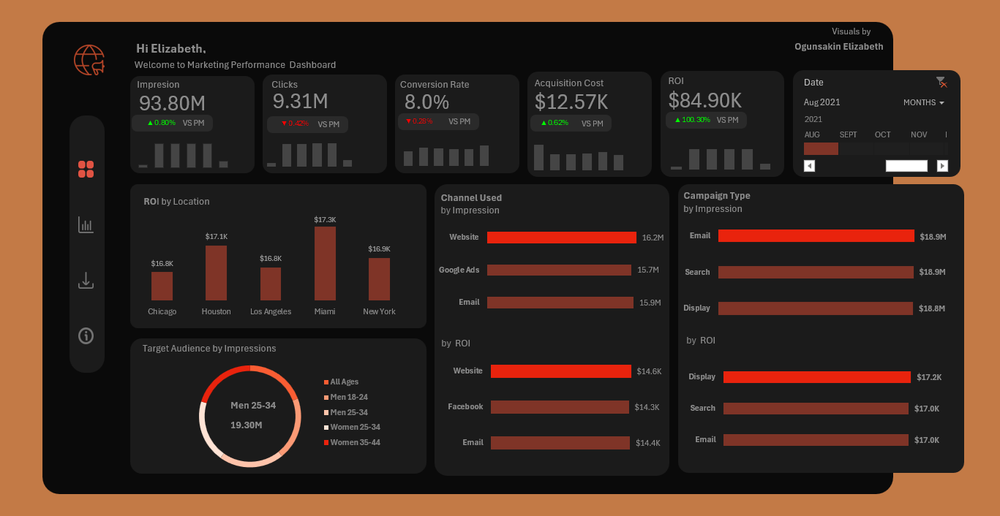

# 📊 Marketing Performance Analysis Dashboard (Excel)

## Executive Summary
This project evaluates the effectiveness of a **2021 marketing campaign** run by five companies across major U.S. cities. Using **Excel and Power Query**, the analysis turns complex marketing data into **clear, actionable insights**, helping stakeholders understand campaign performance and identify areas for improvement.

---

## 🎯 Project Objective
The central question:  
**Was the marketing campaign worth the investment?**

The analysis covers the full marketing funnel—from **ad impressions** to **clicks, conversions, cost, and ROI**—highlighting where value was created and where performance could be optimized.

---

## 🌍 Scope of the Analysis
- **Year:** 2021  
- **Cities Analyzed:** Chicago, Houston, Los Angeles, Miami, New York  
- **Focus Areas:** Marketing reach, audience engagement, conversion efficiency, customer acquisition cost, and return on investment (ROI)

---

## 📂 Dataset Overview
The dataset tracks key marketing metrics along the customer journey:  

- **Ad impressions** (reach)  
- **Clicks** (interest)  
- **Conversion rate** (action)  
- **Customer acquisition cost**  
- **Revenue and ROI**  

The analysis follows the funnel: **See → Click → Act → Value**, providing insights at each stage.

---

## 📈 Key Insights
- **Campaign Reach:** Over **1.1 billion impressions** confirmed high visibility.  
- **Audience Engagement:** **110 million clicks** show strong interest.  
- **Conversion Efficiency:** Only **8% of clicks converted**, highlighting potential for improving post-engagement strategies.  
- **Acquisition Cost:** Approximately **$12.5K** was spent to acquire converting customers.  
- **Revenue:** The campaign generated **$1.0M in returns**, confirming overall profitability.  
- **Top Performing City:** Miami achieved the **highest ROI ($201.8K)** despite not leading in impressions or clicks. This indicates efficient targeting and engagement strategies.  
- **Strategic Opportunity:** Consistent acquisition costs across cities suggest **Miami could be prioritized for future campaigns** to maximize ROI.

---

## 📊 Dashboard

---

## 🛠 Tools & Techniques
- **Microsoft Excel**  
- **Pivot Tables & Pivot Charts**  
- **Power Query** for data cleaning and transformation  
- **Slicers & Conditional Formatting** for interactivity  
- Dashboard design for clear storytelling and actionable insights  

---

## 📁 Repository Contents
- `marketing_campaign_dataset.csv`  
  - Raw data  
  - Analysis sheets  
  - Dashboard visuals  
  - Summary of insights  

---

This project demonstrates the ability to **transform raw marketing data into a visual and analytical dashboard**, generating insights that can drive **strategic marketing decisions** and improve ROI.
